## 常用的门

这里注意到一个有趣的现象，当你在输入1时，你是无法通过一级输出1的，这个原因大概是高电平无法打开PMOS，一次不可能驱动为高，因此与非门和或非门才是一级的基础门，后面可以好好看看拉扎维的门电路论文学习下有没有更简单的方式实现与门。
如上所属，正常使用的MOS是自带取反属性的，同时并联表示并集，串联表示交集，由此组合了与非门和或非门，因此可以认为与非门和或非门是可以扩展输入的。
或门：或非门级联一个非门；
异或门：4+6+4
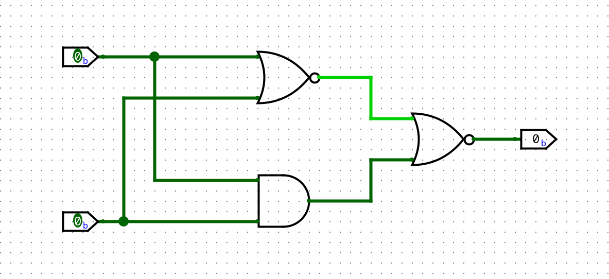
异或门的定制电路想法是通过A选通B和/B；
同或门：同样4+6+4
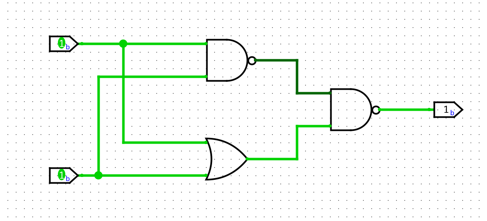
沿用异或门的思路，全定制电路只需要将两个开关管交换，使A选通B，/A选通/B。
跳过二进制、十六进制；
2-4译码器：
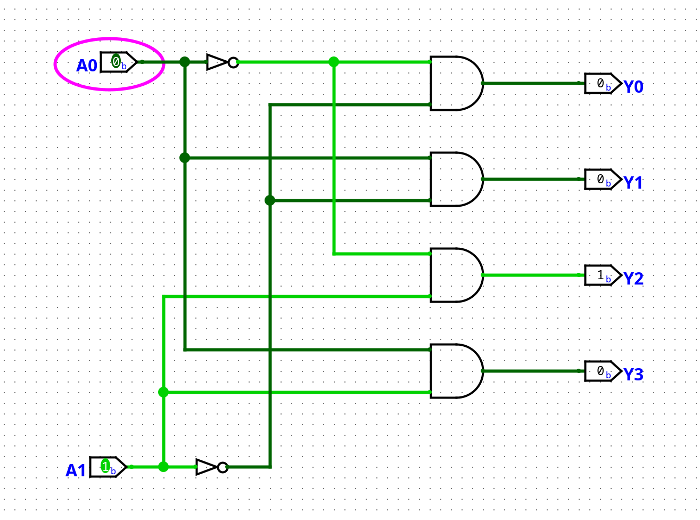
使用两个2-4译码器组合一个3-8译码器：
这个没想明白，正常思路是使用一个2-4译码器将S1S0分出四个，再通过AND 选S2和/S2，这样的话两个译码器就没有必要？
那么我认为两个输入都需要包含不重复的一些信息，以下是我做的尝试：
假设固定有一位输入检测S0，这是不可能的，因为另一个信号无法分辨出两位，那么为了保佑足够信息，只能通过XOR或XNOR进行组合：
又有一个想法，如果想要将两个2-4译码器的共8个输出作为3-8译码器输出，这是不可能的！因为2-4译码器总有一个输出是1，因此8个输出中总有两个1，永远需要在进行一次二选一，这是不合理的！除非2-4编码器拥有使能位。先放下吧。
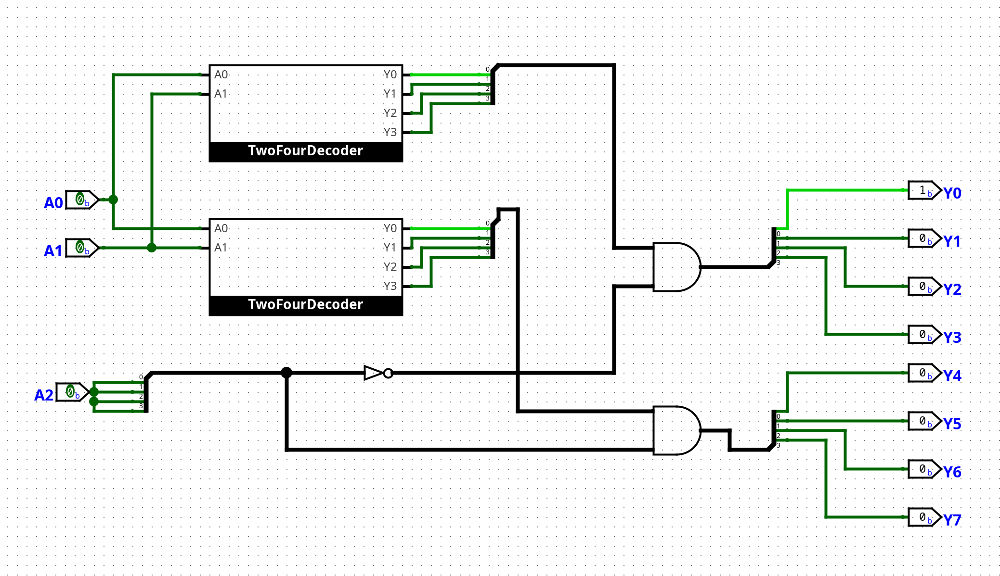

七段码译码器
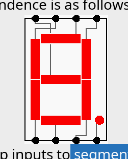
从左到右从上到下

|                                               | 1    | 2    | 3    | 4    | 5    | 6    | 7    |
| --------------------------------------------- | ---- | ---- | ---- | ---- | ---- | ---- | ---- |
| 0                                             | 0    | 1    | 1    | 1    | 1    | 1    | 1    |
| 1                                             | 0    | 0    | 0    | 1    | 0    | 0    | 1    |
| 2                                             | 1    | 0    | 1    | 1    | 1    | 1    | 0    |
| 3                                             | 1    | 0    | 1    | 1    | 0    | 1    | 1    |
| 4                                             | 1    | 1    | 0    | 1    | 0    | 0    | 1    |
| 5                                             | 1    | 1    | 1    | 0    | 0    | 1    | 1    |
| 6                                             | 1    | 1    | 1    | 0    | 1    | 1    | 1    |
| 7                                             | 0    | 0    | 1    | 1    | 0    | 0    | 1    |
| 8                                             | 1    | 1    | 1    | 1    | 1    | 1    | 1    |
| 9                                             | 1    | 1    | 1    | 1    | 0    | 1    | 1    |
| A                                             | 1    | 1    | 1    | 1    | 1    | 0    | 1    |
| b                                             | 1    | 1    | 0    | 0    | 1    | 1    | 1    |
| C                                             | 0    | 1    | 1    | 0    | 1    | 1    | 0    |
| d                                             | 1    | 0    | 0    | 1    | 1    | 1    | 1    |
| E                                             | 1    | 1    | 1    | 0    | 1    | 1    | 0    |
| F                                             | 1    | 1    | 1    | 0    | 1    | 0    | 0    |

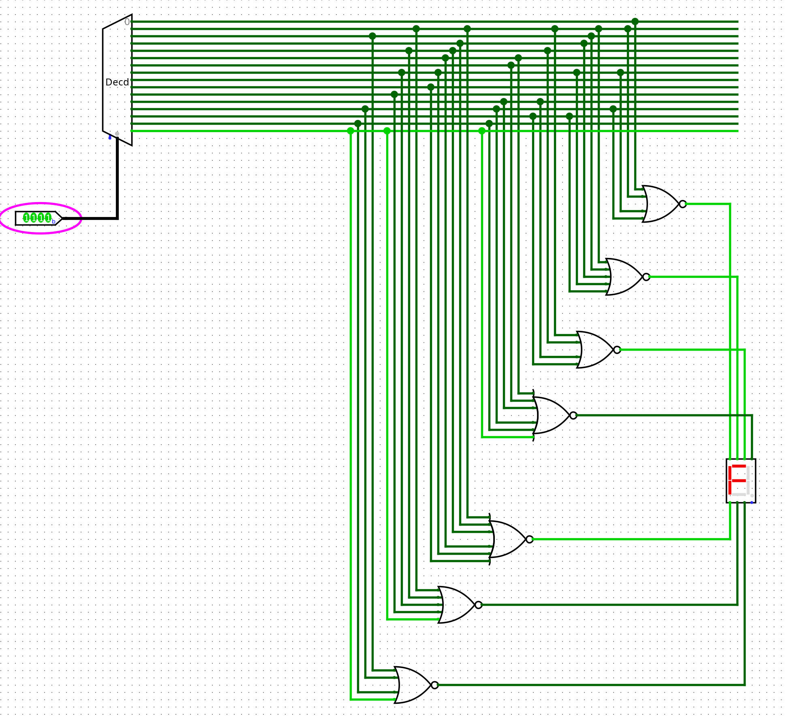
由于每一列1比0多，用或非门连线更少。
今天先这样吧。
Logisim在wayland下bug有点多……做起来太麻烦了。

编码器
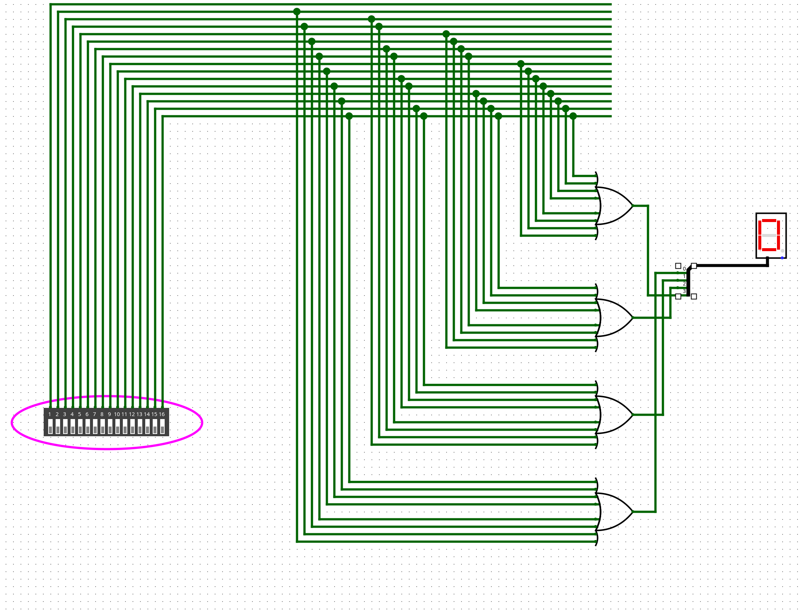
4-2优先编码器比独热码多了一个与门用来区分A3为1时A4是否为0

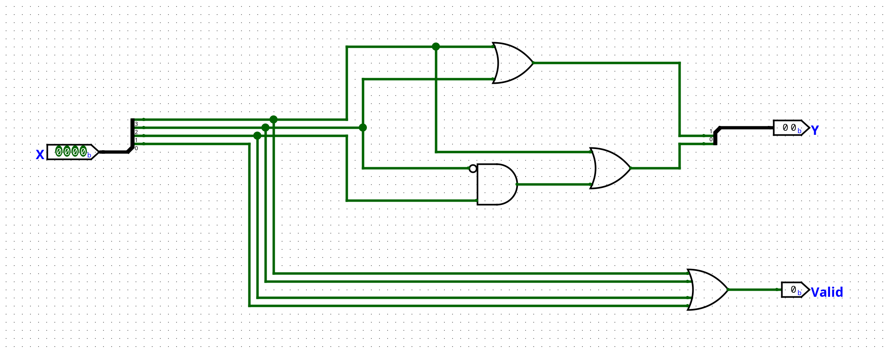
多放了一个Valid信号区分0000。
16-4编码器
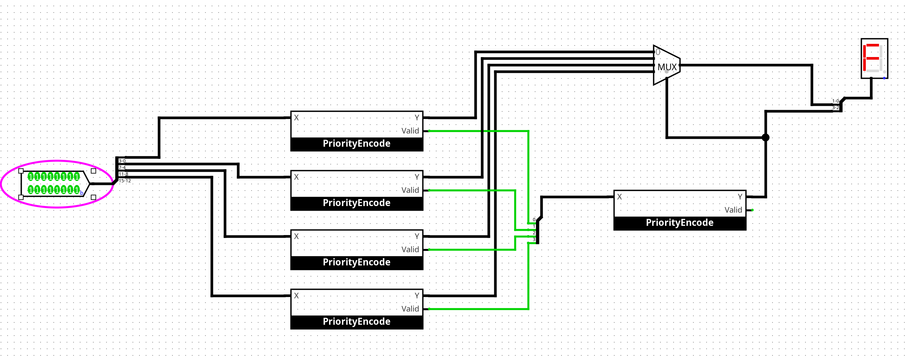
偷懒，用了Mux，有没有不用的方法？
前导0，16-优先编码器输出-1，优先编码器输出取反
尾随0，倒过来优先编码器取反
前导1和尾随1都先取反在计算
存在一个小问题是没法区分全零、全一这种类型

Mux
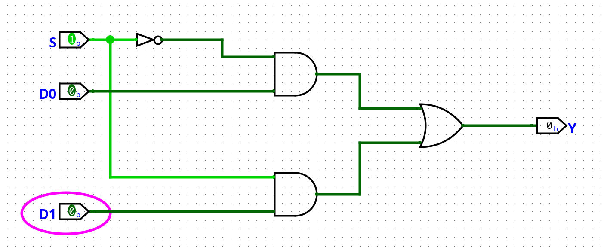
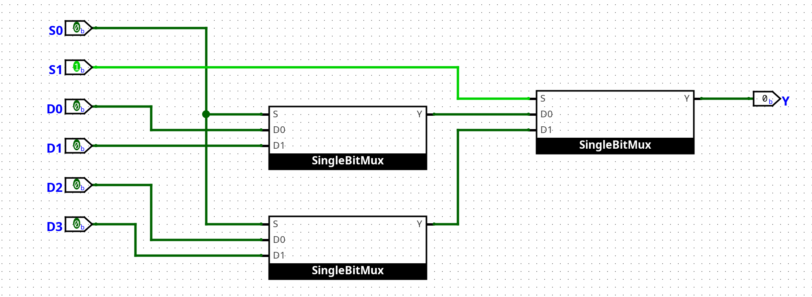
扩展成3位就可以了。
比较器
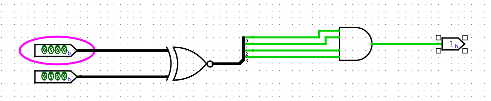
全加器
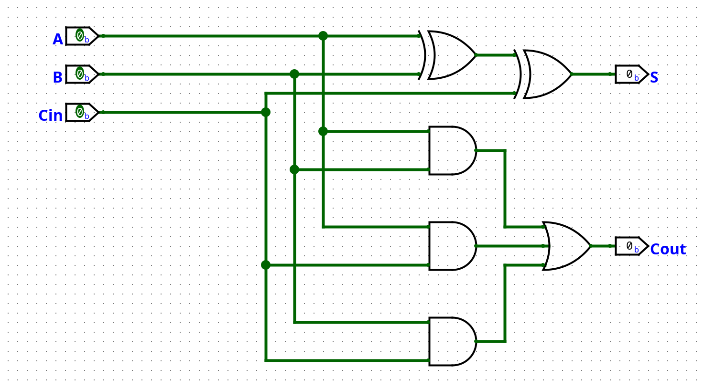
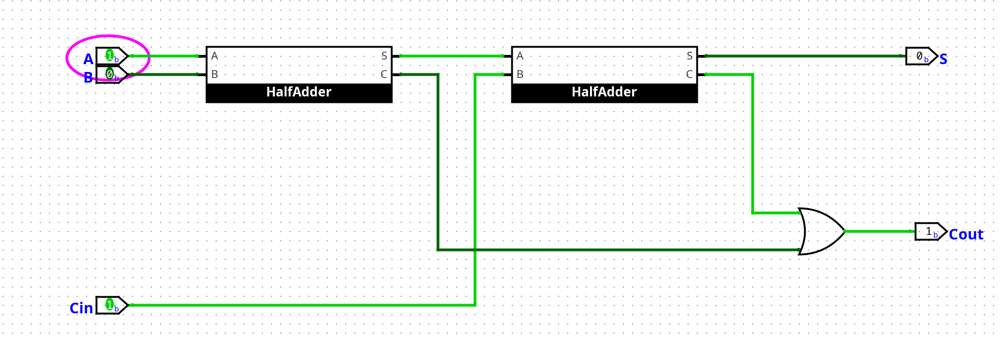
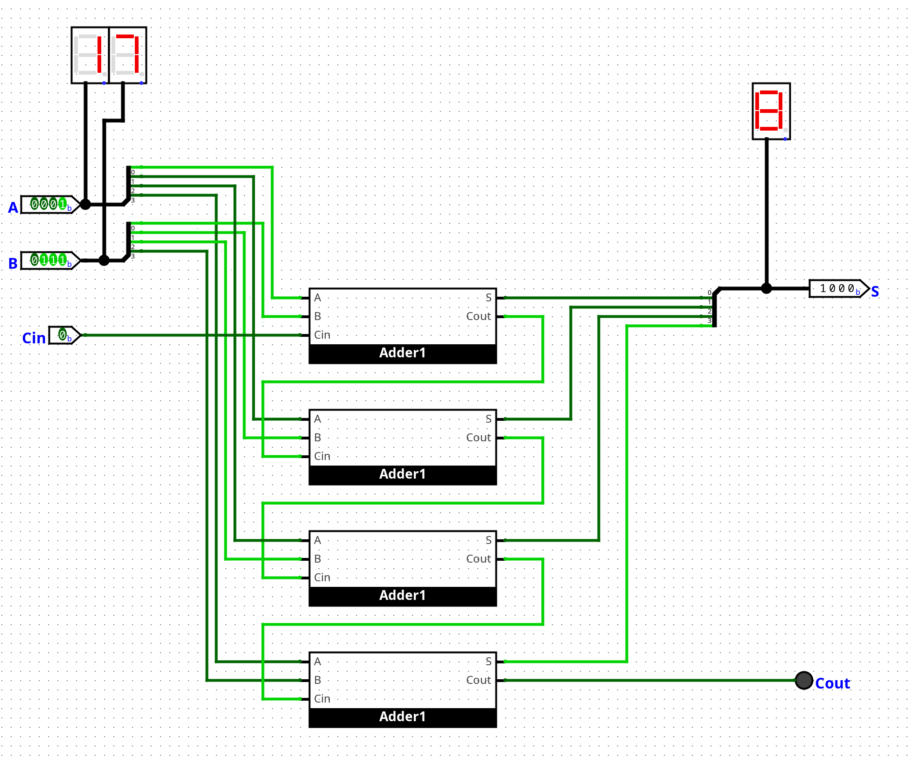
先创建一个半减器
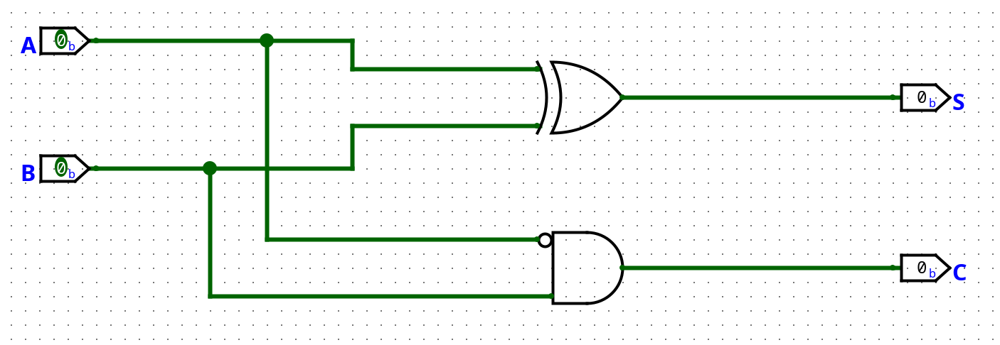
按照全加器的想法做一个全减器
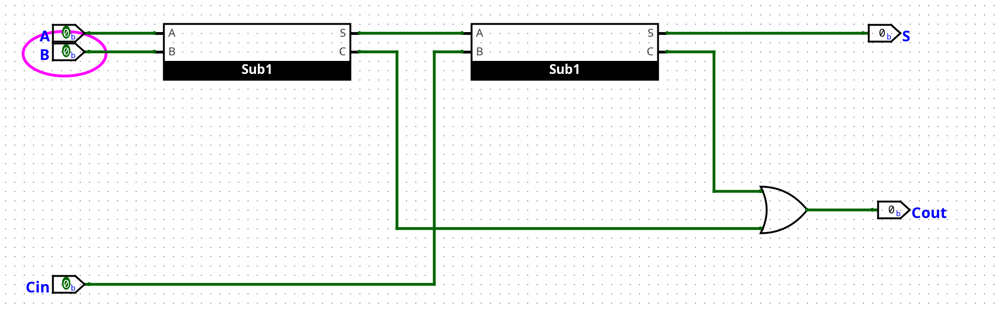
在创建原码加法器之前，先来讨论一下：
把数分为符号位和数据

| B\A                                                          | +      | -      |
| ------------------------------------------------------------ | ------ | ------ |
| +                                                            | +(A+B) | -(A-B) |
| -                                                            | +(A-B) | -(A+B) |

进位：!(A^B)&Cadder
不存在借位，但存在取反，若Csub，取A符号的反             因为已经有了四位加法器和四位减法器，这里直接做一个5位原码加法器
这里发现在计算A-B时，如果A<B，会输出绝对值的补码，那么只想到通过两个减法器做这个操作。
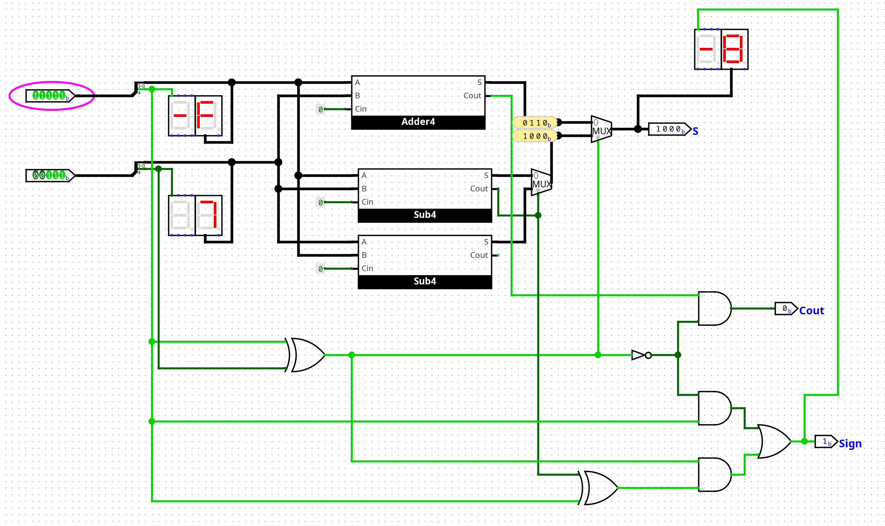
目前是用的是这种解法，连线有些乱，分三种情况讨论：

* A、B同号，输出数值为加法器数值，Cout为加法器进位，符号为A符号；
* A、B异号，且A>=B，输出应为A-B减法器，且不借位，符号为A符号；
* A、B异号，且A<B，输出应为B-A减法器，且A-B减法器借位，符号为B符号，即A符号取反。

反码加法器
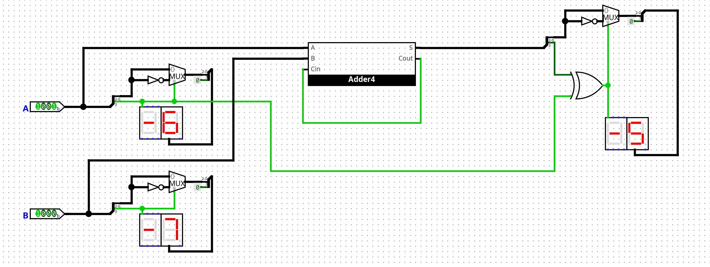
太神奇了，这里也能遇到反馈。
原因是反码的!A=7-A，也就是!A=-1-A，因此相加有以下几种可能：

* A正B正，相加不进位：S=|A+B|=|A|+|B|=A+B
* A负B负，S=7-|A+B|=7-(|A|+|B|)=(7-|A|)+(7-|B|)+1-8，刚好此时由于最高位符号位都是1会进位
* A正B负，且|A|>|B|，|A+B|=|A|-|B|=A-(7-B)=A+B+1-8，刚好此时会进位
* A正B负，且|A|<|B|，|A+B|=|B|-|A|=

## 交叉配对反相器

| Ain  | Bin  | Aout | Bout |      |
| ---- | ---- | ---- | ---- | ---- |
| 0    | 0    | 1    | 1    | 振荡 |
| 0    | 1    | 0    | 1    | 稳定 |
| 1    | 0    | 1    | 0    | 稳定 |
| 1    | 1    | 0    | 0    | 振荡 |

## S-R锁存器

| R                                     | S    | Q    | /Q   |                  |
| ------------------------------------- | ---- | ---- | ---- | ---------------- |
| 0                                     | 0    |      |      | 交叉配对反相器   |
| 0                                     | 1    | 1    | 0    | 置1              |
| 1                                     | 0    | 0    | 1    | 置0              |
| 1                                     | 1    | 0    | 0    | 全零，会进入振荡 |
| 注意到只要R、S不同时为1，就能保持稳定 |      |      |      |                  |

| /R   | /S   | Q    | /Q   |                 |
| ---- | ---- | ---- | ---- | --------------- |
| 0    | 0    | 1    | 1    | 全1，会进入震荡 |
| 0    | 1    | 1    | 0    | 置1             |
| 1    | 0    | 0    | 1    | 置0             |
| 1    | 1    | 0    | 0    | 交叉配对反相器  |

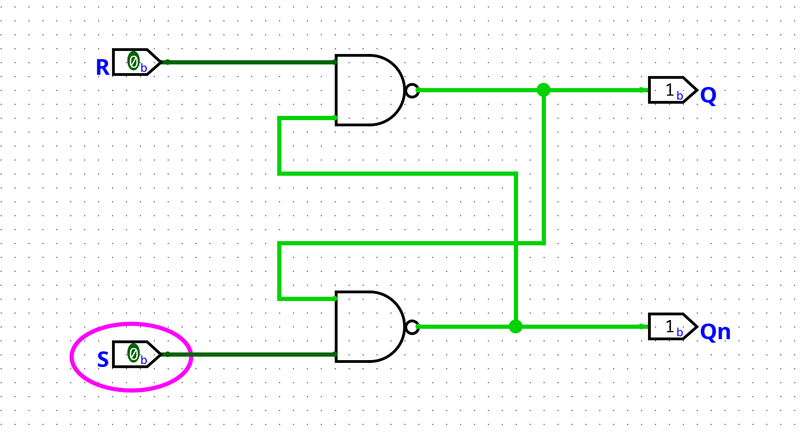

## D锁存器

| D    | WE   | S    | R    | Q    | /Q   |                |
| ---- | ---- | ---- | ---- | ---- | ---- | -------------- |
| X    | 0    | 0    | 0    |      |      | 交叉配对反相器 |
| 0    | 1    | 0    | 1    | 0    | 1    | 置0            |
| 1    | 1    | 1    | 0    | 1    | 0    | 置1            |

带复位实现
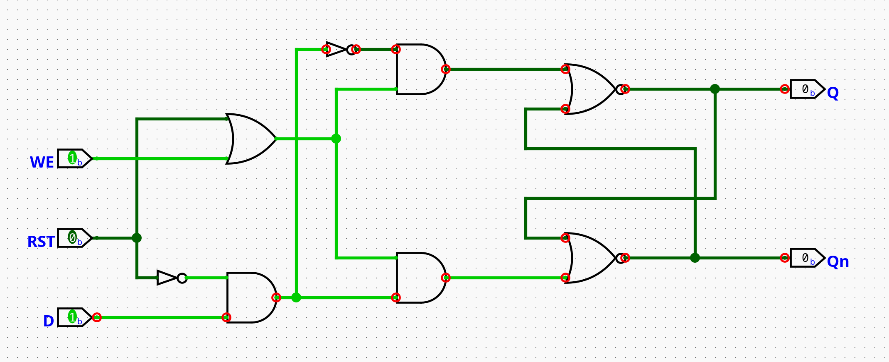
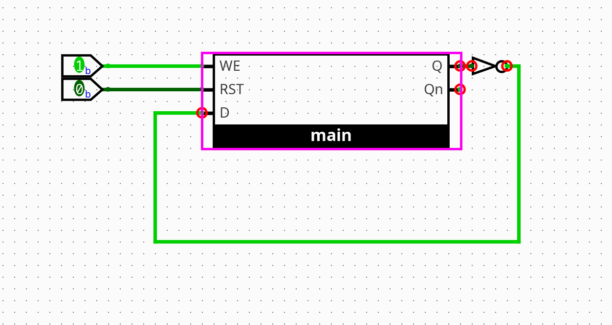
该种连接会振荡
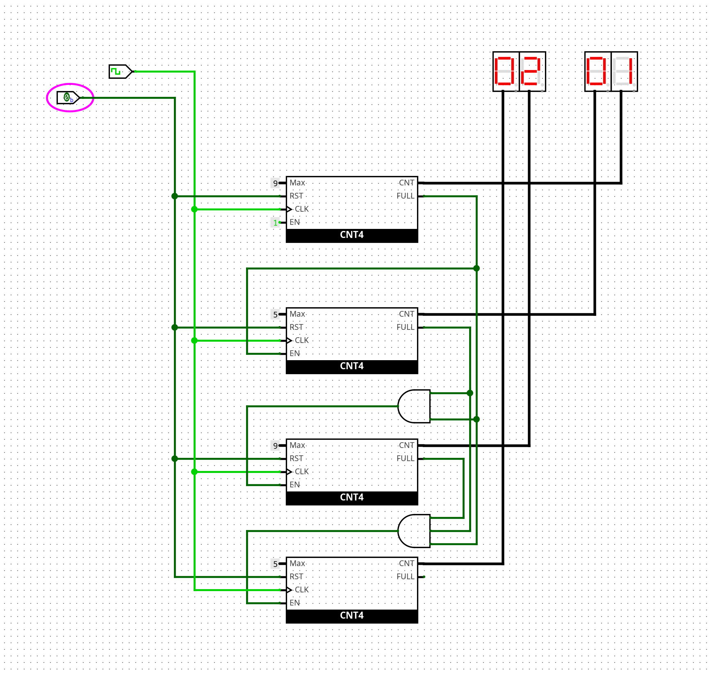